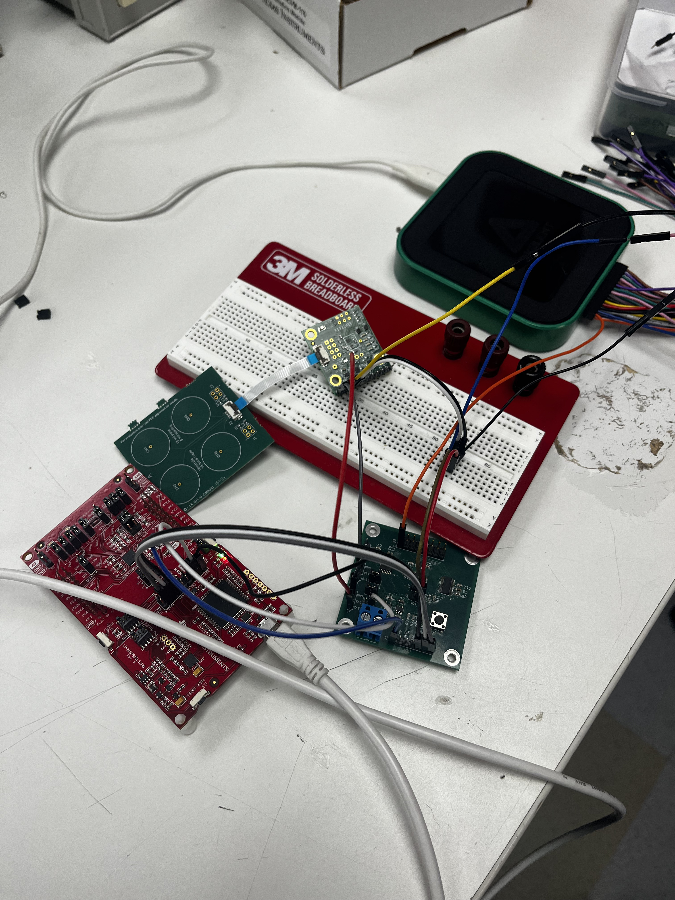
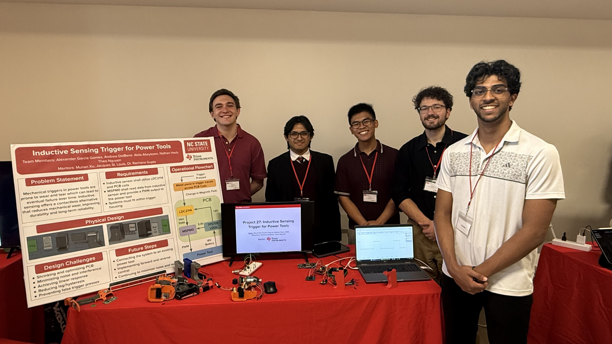
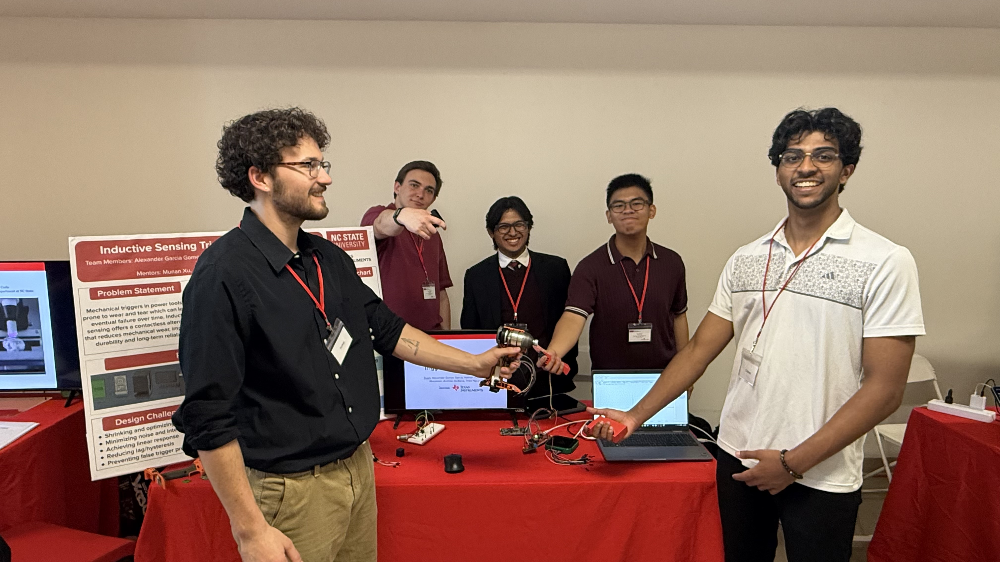

# LDC2114 Inductive Sensor PWM Controller

Firmware for an MSPM01306 that reads an LDC2114 inductive-to-digital converter over I2C and drives a PWM output proportional to the sensed value.

## Overview

The system continuously samples channel 0 of the LDC2114, runs the readings through a moving-average filter, and maps the filtered value to a PWM duty cycle. When the LDC's `OUT` status bit for channel 0 is asserted, the duty cycle tracks the sensor; otherwise the output is held at zero.

## Hardware

The firmware targets two boards:

1. **Primary PCB (working)** — a larger development PCB ported from the LaunchPad/EVM. This is the configuration the current pin assignments and PWM GPIO mapping in `ti_msp_dl_config` are set up for.
2. **Secondary PCB (port required)** — a smaller production PCB intended to be programmed and debugged using pogo pins rather than a permanent debug header. The PWM GPIO assignment differs on this board and must be updated in SysConfig before flashing.

### Porting to the secondary PCB

Before building for the secondary board:

- Open the `.syscfg` file in CCS and reassign the PWM timer output to the GPIO pin used on the secondary PCB.
- Regenerate `ti_msp_dl_config.c/.h`.
- Confirm the I2C SDA/SCL pins still match; reassign in SysConfig if not.
- Connect the programmer through the pogo-pin fixture (SWDIO, SWCLK, RESET, GND, and VCC).

LDC2114 register settings (gain, scan rate, polarity, channel enables) may also need adjustment for the secondary PCB depending on coil geometry and target material. Tune these in `LDC2114_Init()` in `ldc_driver.c`.

## Software Components

- `main.c` — initializes peripherals and runs the sample/filter/PWM loop.
- `i2c_driver.c/.h` — blocking I2C controller transfers with FIFO refill via interrupt. Shared TX/RX buffers and status enum.
- `ldc_driver.c/.h` — LDC2114 register access, init sequence, and channel 0 read returning a sign-extended 12-bit value plus status bytes.
- `pwm_driver.c/.h` — maps a sensor reading in the range `[PWM_MIN_SENSOR_VALUE, PWM_MAX_SENSOR_VALUE]` to a timer capture-compare value, and provides start/stop control.
- `filter.c/.h` — fixed-size moving average filter (max 32 samples) using a running sum and circular buffer.

## Operation

1. `SYSCFG_DL_init()` configures clocks, I2C, the PWM timer, and GPIOs.
2. The I2C interrupt is enabled in the NVIC.
3. The PWM timer is initialized but not started.
4. A delay allows the LDC2114 to power up, after which `LDC2114_Init()` enters config mode, enables channel 0, sets gain and scan rate, configures interrupt and output polarity, and exits config mode.
5. The moving-average filter is initialized with a window of 8 samples.
6. PWM output begins.
7. The main loop reads channel 0, updates the filter, prints raw and filtered values, and updates the duty cycle.

## Configuration Notes

- LDC2114 I2C address: `0x2A`
- Filter window: 8 samples (change in `Filter_Init()` call in `main.c`; max 32)
- Sensor-to-duty mapping range: 0 to 2048 (see `pwm_driver.h`)
- I2C TX/RX buffers: 16 bytes each

If the LDC's full-scale reading on the secondary PCB falls outside `[0, 2048]`, update `PWM_MAX_SENSOR_VALUE` and `PWM_RANGE` in `pwm_driver.h` so the duty cycle uses the full timer period.

## Building

Open the project in Code Composer Studio with the MSPM0 SDK installed. Build, then flash via XDS110 (primary board) or pogo-pin fixture (secondary board).

## Media

### Recognition

Featured by NC State ECE: [Instagram post](https://www.instagram.com/reel/DXY7Jv2DaC1/)

### PCB Hardware

*First-revision PCB, ported from the LaunchPad/EVM, utilizing EVM parts for LDC and AD3 for reading PWM Signal.*

*Same PCB, utilizing only the Coil as an external unit.*

### Demo

https://github.com/user-attachments/assets/26e05707-506c-4c2a-8fe2-b1f03728651a

### Team

